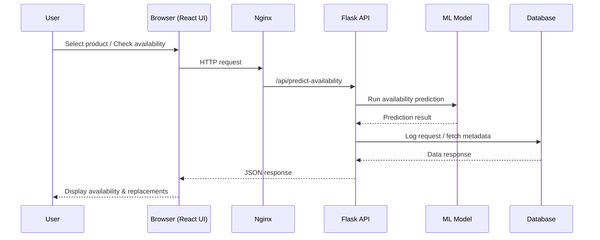

# 🛒 Grocery Availability Recommender

                 

A full-stack, machine-learning–powered system that predicts multi-domain product availability and suggests intelligent replacements when items are likely to be out of stock.

This project is inspired by real-world problems faced by online grocery platforms (e.g., Instacart) and is implemented **entirely using free and open-source tools**.

---

## 📖 Table of Contents

-   [Problem Statement](#-problem-statement)
    -   [Objective](#objective)
-   [Features](#-features)
-   [System Architecture](#-system-architecture)
    -   [High-Level Architecture Diagram](#high-level-architecture-diagram)
-   [API Flow (Sequence Diagram)](#-api-flow-sequence-diagram)
-   [Tech Stack](#-tech-stack)
    -   [Frontend](#frontend)
    -   [Backend](#backend)
    -   [Database](#database)
    -   [DevOps](#devops)
-   [Project Structure](#-project-structure)
-   [Setup & Installation](#-setup--installation)
    -   [Prerequisites](#prerequisites)
    -   [Run with Docker (Recommended)](#-run-with-docker-recommended)
-   [API Endpoints](#-api-endpoints)
-   [Example Workflow](#-example-workflow)
-   [Machine Learning Details](#-machine-learning-details)
-   [Docker & Production Readiness](#-docker--production-readiness)
-   [License](#-license)
-   [Academic Use](#-academic-use)
-   [Team](#-team)
-   [Contact](#-contact)
-   [Acknowledgements](#-acknowledgements)
-   [Disclaimer](#-disclaimer)
-   [References](#-references)

---

## 📌 Problem Statement

In online grocery shopping, items frequently go out of stock.  
This leads to:

-   Cart abandonment
-   Poor customer experience
-   Low acceptance of replacements

### Objective

1.  Predict whether a grocery item is likely to be **available or out of stock**
2.  Suggest **intelligent replacements** based on similarity and category
3.  Deliver the solution as an **end-to-end full-stack product**

---

## 🚀 Features

-   🔮 **Availability Prediction**
    
    -   Domain-aware machine learning models
    -   Predicts if a product is *Available* or *Out of Stock*
-   🟢 **Availability Status Badge**
    
    -   Clear visual indicator (Available / Out of Stock)
-   📊 **Sales vs Availability Visualization**
    
    -   Interactive chart showing relationship between sales & availability
-   🔁 **Similarity-Based Replacement Suggestions**
    
    -   TF-IDF + cosine similarity based recommendations
    -   Intelligent alternatives when items are unavailable
-   🔄 **Multi-Domain Support**
    
    -   Grocery, Electronics, Accessories
    -   Automatic domain detection & switching
-   🧠 **Auto-Training ML Pipeline**
    
    -   Automatic preprocessing & model training on container startup
-   🌐 **Full-Stack Application**
    
    -   React frontend + Flask backend
-   🐳 **Dockerized Deployment**
    
    -   Fully containerized with Docker Compose
-   ❤️ **Health Checks**
    
    -   Backend health endpoint for production readiness

---

## 🏗️ System Architecture

```
                                      ┌──────────────┐
                                      │   Browser    │
                                      │  (React UI)  │
                                      └──────┬───────┘
                                             │ HTTP
                                             ▼
                                  ┌──────────────────────┐
                                  │     NGINX (80)       │
                                  │  Static React Build  │
                                  └────────┬─────────────┘
                                           │ /api/* proxy
                                           ▼
                        ┌────────────────────────────────────────┐
                        │           Backend (Flask API)          │
                        │                                        │
                        │  Routes:                               │
                        │  • /api/domains                        │
                        │  • /api/products?domain=x              │
                        │  • /api/predict-availability           │
                        │  • /api/recommend                      │
                        │  • /health                             │
                        └───────────────┬────────────────────────┘
                                        │
              ┌─────────────────────────┼─────────────────────────┐
              │                         │                         │
              ▼                         ▼                         ▼
┌─────────────────────────┐   ┌─────────────────────────┐   ┌──────────────────┐
│  Auto Preprocessing     │   │  Auto ML Training       │   │  SQLite / SQL DB │
│  preprocess.py          │   │  (on container startup) │   │  (optional)      │
│                         │   │                         │   │                  │
│  raw → processed CSV    │   │  Availability Models    │   │                  │
│  (per domain)           │   │  (per domain)           │   │                  │
└──────────────┬──────────┘   │  Replacement Model      │   │                  │
               │              │  (TF-IDF + Cosine Sim)  │   └──────────────────┘
               ▼              └──────────────┬──────────┘
┌────────────────────────────────────────────────────────────┐
│                   ML Model Artifacts (.pkl)                │
│                                                            │
│  • availability_model_grocery.pkl                          │
│  • availability_model_electronics.pkl                      │
│  • availability_model_accessories.pkl                      │
│  • availability_model.pkl (fallback)                       │
│  • replacement_model.pkl (similarity-based)                │
└────────────────────────────────────────────────────────────┘
```

### High-Level Architecture Diagram


### Description

-   The React frontend is served via **Nginx**
-   All `/api/*` requests are routed to the **Flask backend**
-   Flask loads trained **ML models (.pkl)** for predictions
-   Data is stored in a relational database (**SQLite / PostgreSQL**)
-   The entire system is **containerized using Docker Compose**
-   Backend auto-preprocesses all domains on startup
-   Domain-specific ML models are trained automatically
-   Frontend visualizes predictions using badges and charts

---

## 🔄 API Flow (Sequence Diagram)



**✅ If Mermaid does NOT render on GitHub (backup)**

You can also export this as an image later using:

-   Mermaid Live Editor
-   draw.io
-   PlantUML

---

## 🧰 Tech Stack

### Frontend

-   React
-   HTML5, CSS3
-   Nginx (production serving)

### Backend

-   Python 3.12
-   Flask + Flask-CORS
-   SQLAlchemy
-   Scikit-learn

### Database

-   SQLite (local)
-   PostgreSQL (production-ready)

### DevOps

-   Docker
-   Docker Compose

---

## 📂 Project Structure

```
grocery-availability-recommender/
│
├── .github/                                  # GitHub configuration
│   └── workflows/
│       └── ci.yml                            # CI pipeline (build, test, Docker checks)
│
├── backend/                                  # Flask backend + ML system
│   │
│   ├── app.py                                # Flask app entry point + route registration
│   ├── config.py                             # Environment variables & path config
│   ├── startup.py                            # Auto-preprocess + auto-train on container start
│   ├── models.py                             # Model loaders (domain-aware availability & replacement)
│   ├── requirements.txt                      # Python dependencies
│   ├── Dockerfile                            # Backend Docker image definition
│   ├── __init__.py                           # Python package marker
│   │
│   ├── database/                             # Database layer (optional / future use)
│   │   ├── db.py                             # SQLAlchemy engine & helpers
│   │   └── schema.sql                        # Reference SQL schema
│   │
│   ├── ml/                                   # Machine Learning training logic
│   │   ├── train_availability.py             # Trains availability model (per-domain + fallback)
│   │   ├── train_replacement.py              # Trains TF-IDF similarity replacement model
│   │   └── __init__.py
│   │
│   ├── models/                               # Saved ML artifacts (auto-generated)
│   │   ├── __init__.py
│   │   ├── availability_model.pkl            # Global availability model (fallback)
│   │   ├── availability_model_grocery.pkl    # Domain-specific availability model
│   │   ├── availability_model_electronics.pkl
│   │   ├── availability_model_accessories.pkl
│   │   └── replacement_model.pkl             # TF-IDF + cosine similarity model
│   │
│   ├── routes/                               # Flask API routes (Blueprints)
│   │   ├── __init__.py
│   │   ├── availability.py                   # POST /api/predict-availability
│   │   ├── replacement.py                    # POST /api/recommend
│   │   └── products.py                       # GET /api/products, /api/domains
│   │
│   └── utils/                                # Shared utilities
│       ├── preprocess.py                     # Converts raw → processed features per domain
│       ├── helpers.py                        # File/path helpers
│       └── __init__.py
│
├── frontend/                                 # React frontend (served by Nginx)
│   │
│   ├── Dockerfile                            # Multi-stage React → Nginx build
│   ├── package.json                         # Frontend dependencies & scripts
│   ├── .dockerignore                        # Ignore node_modules, build cache
│   │
│   ├── public/                              # Static public assets
│   │   ├── index.html                       # HTML entry point
│   │   ├── favicon.ico                      # Browser favicon
│   │   └── manifest.json                    # PWA metadata
│   │
│   └── src/
│       ├── index.js                         # React root renderer
│       ├── App.js                           # Main application component
│       ├── api.js                           # Backend API abstraction (domain-aware)
│       │
│       ├── components/                      # UI components
│       │   ├── ProductList.jsx              # Product selector list
│       │   ├── Availability.jsx             # Availability input & request
│       │   ├── AvailabilityBadge.jsx        # Green/Red availability badge
│       │   ├── Replacement.jsx              # Replacement suggestions list
│       │   ├── SalesChart.jsx               # 📊 Sales vs Availability chart
│       │   └── NewWidget.jsx                # Dashboard stat widget
│       │
│       └── styles/
│           └── App.css                      # Global styling
│
├── data/                                    # Domain-based datasets
│   │
│   ├── grocery/
│   │   ├── raw/
│   │   │   └── products.csv                 # Raw grocery product list
│   │   └── processed/
│   │       └── features.csv                 # ML-ready features for grocery (auto-generated)
│   │
│   ├── electronics/
│   │   ├── raw/
│   │   │   └── products.csv                 # Raw electronics product list
│   │   └── processed/
│   │       └── features.csv                 # ML-ready features for electronics (auto-generated)
│   │
│   └── accessories/
│       ├── raw/
│       │   └── products.csv                 # Raw accessories product list
│       └── processed/
│           └── features.csv                 # ML-ready features for accessories (auto-generated)
│
├── docs/                                    # Documentation
│   └── assets/
│       └── architecture.png                 # System architecture diagram
│
├── grocery.db                               # Optional SQLite DB (local dev)
├── docker-compose.yml                       # Orchestrates backend + frontend containers
├── CHANGELOG.md                             # 
├── .gitignore                               # Git ignore rules
├── LICENSE                                  # Project license
└── README.md                                # Project overview & usage guide
```

**🏷️ File Classification Summary**

1.  CORE (Manually Written)
    
    -   app.py, routes/, React components, Dockerfiles
    -   README.md, LICENSE, docker-compose.yml
    -   docs/assets/architecture.png
    -   ci.yml
2.  AUTO-GENERATED
    
    -   **init**.py
    -   *.pkl (ML models)
    -   features.csv
3.  OPTIONAL
    
    -   grocery.db
    -   favicon.ico
    -   manifest.json
    -   NewWidget.jsx
4.  RUNTIME (Not in Repo)
    
    -   Docker containers
    -   Networks, volumes, logs

---

## ⚙️ Setup & Installation

### Prerequisites

-   Docker
-   Docker Compose
-   Git

---

### ▶️ Run with Docker (Recommended)

> Before running, ensure Docker daemon is active or open Docker Desktop.

```docker
docker compose up --build     # Build and start all services in your terminal/powershell from project root.
```

**or**

```dockerfile
docker compose up backend     # For backend
docker compose up frontend    # Fpr frontend
docker compose up             # For merging and compossing both backent and frontend like integration.
```

> To stop the services, press `CTRL + C` in the terminal/powershell where `docker compose up` is running. to force stop the process, press CTRL + C twice.

```docker
docker compose down            # Stop and remove containers when done. (optional)
```

**Additional Information:**
**More commands to manage the Docker Compose setup:**

```docker
docker compose logs -f              # View real-time logs for all services.
docker compose logs -f backend      # View real-time logs for backend only.
docker compose logs -f frontend     # View real-time logs for frontend only.
docker compose ps                   # List running containers and their status.
docker compose exec backend bash    # Access backend container shell for debugging.
docker compose exec frontend bash   # Access frontend container shell for debugging.
docker compose restart             # Restart all services.
docker compose stop                # Stop all services without removing containers.
docker compose start               # Start previously stopped services.
docker compose build               # Rebuild images without starting containers.
docker compose pull                # Pull latest images from remote registry.
docker compose config              # Validate and view the effective Docker Compose configuration.
docker compose version             # Check installed Docker Compose version.
docker compose help                # Display help information for Docker Compose commands.
docker compose top                 # Display running processes inside containers.
docker compose port backend 5000   # Show mapped port for backend service.
docker compose port frontend 80    # Show mapped port for frontend service.
docker compose run backend python app.py  # Run a one-off command in the backend container.
docker compose run frontend npm start     # Run a one-off command in the frontend container.
docker compose rm                  # Remove stopped service containers.
docker compose logs --tail=100     # Show last 100 lines of logs for all services.
docker compose logs --tail=100 backend    # Show last 100 lines of logs for backend only.
docker compose logs --tail=100 frontend   # Show last 100 lines of logs for frontend only
docker compose pause               # Pause all running services.
docker compose unpause             # Unpause all paused services.
docker compose events              # View real-time events from the Docker daemon related to the services.
docker compose scale backend=3 frontend=2 # Scale services to specified number of containers.
```

---

## 🔌 API Endpoints
```table
| Method | Endpoint | Description |
|------|--------|-------------|
| GET | `/` | API status |
| GET | `/health` | Health check |
| GET | `/api/domains` | List available domains |
| GET | `/api/products?domain=grocery` | Fetch products by domain |
| POST | `/api/predict-availability` | Predict availability |
| POST | `/api/recommend` | Get similarity-based replacements |
```

### Access the application:
```link
http://localhost:3000                                 # Frontend (React Dashboard)
http://localhost:5000                                 # Backend API (Flask)
http://localhost:5000/health                          # Backend Health Check
http://localhost:5000/api/domains                     # Available Product Domains
http://localhost:5000/api/products?domain=grocery     # Products by Domain
```

### Each url is used for,
```table
| URL             | Purpose                                              |
| --------------- | ---------------------------------------------------- |
| `:3000`         | User-facing React UI                                 |
| `:5000`         | Backend API base                                     |
| `/health`       | Docker & production readiness check                  |
| `/api/domains`  | Verify detected domains (grocery, electronics, etc.) |
| `/api/products` | Fetch domain-specific product catalog                |
```

---

## 🧪 Example Workflow

1.  User selects a domain (grocery / electronics / accessories)
2.  User selects a product
3.  Enters recent sales and day
4.  ML model predicts availability
5.  Availability badge updates instantly
6.  Sales vs availability chart is rendered
7.  If unavailable, similar replacements are suggested

---

## 🖼️ Screenshots

> Screenshots are captured from the running Dockerized application.

### 📌 Dashboard Overview
- Domain selector
- Product list
- Availability widgets

📷 `docs/assets/screenshots/dashboard.png`


### 📊 Sales vs Availability Chart
- Visual correlation between sales and stock availability
- Updates dynamically per product

📷 `docs/assets/screenshots/sales_chart.png`


### 🟢 Availability Badge
- Green: Available
- Red: Out of Stock

📷 `docs/assets/screenshots/availability_badge.png`


### 🔁 Replacement Suggestions
- Similarity-based alternatives
- Ranked by cosine similarity

📷 `docs/assets/screenshots/replacements.png`

---

## 🧠 Machine Learning Details

### Availability Model

-   Logistic Regression (Scikit-learn)
-   Features:
    -   Recent sales
    -   Day of week
-   Separate model per domain
-   Automatic training on container startup

### Replacement Model

-   TF-IDF Vectorization
-   Cosine Similarity
-   Text-based similarity between product names

> Models are lightweight, explainable, and optimized for real-time inference.

---

## 🐳 Docker & Production Readiness

-   Multi-stage frontend build (React → Nginx)
-   Backend health checks
-   Containerized services
-   Environment-based configuration
-   Ready for cloud deployment (AWS / Render / Fly.io)

---

## 🔒 License

This project is released under a custom restrictive license.

-   ❌ No redistribution
-   ❌ No commercial use
-   ❌ No replication without permission

See the [LICENSE](LICENSE) file for details.

---

## 🎓 Academic Use

This project is developed as a Final Year End-Semester Project.

-   ✔ Uses only free & open-source tools
-   ✔ Inspired by real-world industry problems
-   ✔ Designed for demonstration, review, and viva

---

## 👥 Team

-   Final Year Team Project
-   Team Members:
    -   Sanjai S - Reg No. 23UAI0048
    -   Madhumitha V - Reg No. 23UAI0032
    -   Gayathri - Reg No. 23
    -   Dharshini - Reg No. 23UCS
-   Institution:
    -   XYZ Institute of Technology
-   Department of B.Sc Computer Science (AI & Data Science)

---

## 📞 Contact

For academic or permission-based usage, please contact the project owner.

> Project Owner: Sanjai S Email: [sanjai.workemail@gmail.com](mailto:sanjai.workemail@gmail.com) GitHub: [sanjai-s](https://github.com/SANJAI-s0) LinkedIn: [sanjai-s](https://www.linkedin.com/in/sanjai-----s) LeetCode: [sanjai-s0](https://leetcode.com/u/Sanjai0/)

---

## ⭐ Acknowledgements

-   Inspired by real-world grocery platforms like Instacart
-   Built using open-source libraries and tools
-   Thanks to the academic mentors and peers for support
-   Special thanks to the open-source community for providing free tools and libraries

---

## 📜 Disclaimer

-   This project is developed solely for academic purposes as part of a Final Year End-Semester Project. It is not intended for commercial use or redistribution. The models and system are simplified for demonstration and evaluation in an academic setting.
-   Please seek permission from the project owner for any use beyond academic review.
-   The project is provided "as is" without any warranties. The authors are not liable for any damages arising from its use.
-   By using this project, you agree to comply with the terms outlined in the LICENSE file.
-   For any questions or clarifications, please contact the project owner.
-   Thank you for respecting the academic integrity and purpose of this work.
-   Happy Learning! 🎓

---

## 📚 References

-   [Flask Documentation](https://flask.palletsprojects.com/)
-   [React Documentation](https://reactjs.org/docs/getting-started.html)
-   [Scikit-learn Documentation](https://scikit-learn.org/stable/documentation.html)
-   [Docker Documentation](https://docs.docker.com/)
-   [Nginx Documentation](https://nginx.org/en/docs/)
-   [SQLite Documentation](https://www.sqlite.org/docs.html)
-   [PostgreSQL Documentation](https://www.postgresql.org/docs/)
-   [SQLAlchemy Documentation](https://docs.sqlalchemy.org/en/14/)
-   [Docker Compose Documentation](https://docs.docker.com/compose/)
-   [Open-Source Software Principles](https://opensource.org/osd)
-   [Machine Learning Basics](https://en.wikipedia.org/wiki/Machine_learning)
-   [GitHub Guides](https://guides.github.com/)
-   [Markdown Guide](https://www.markdownguide.org/)
-   [Creative Commons Licenses](https://creativecommons.org/licenses/)
-   [Software Licensing Basics](https://choosealicense.com/)

---

**© 2026 Team. All rights reserved.**
