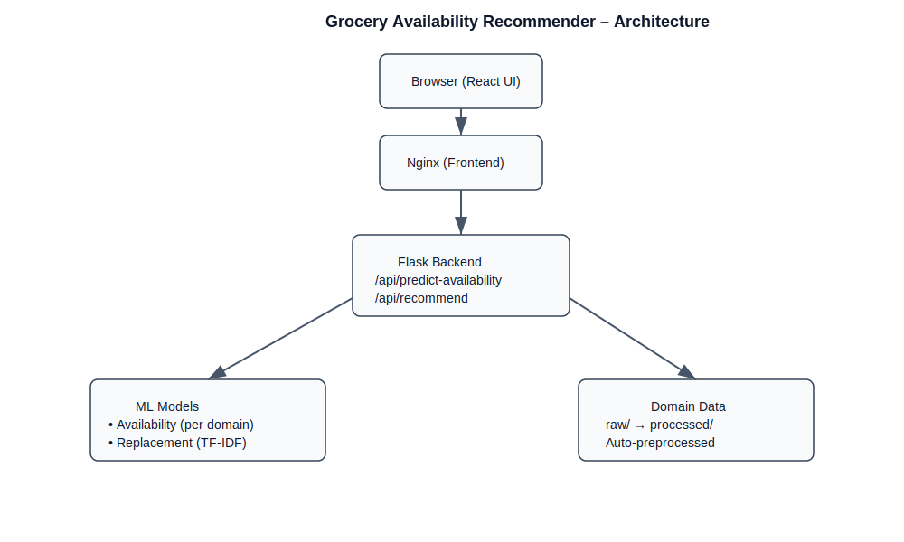
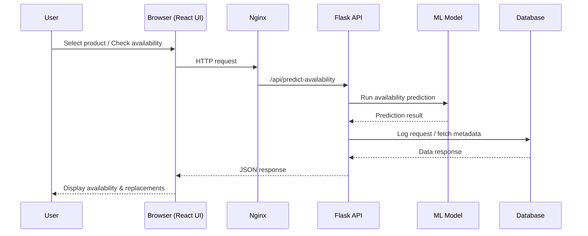

# 🛒 Grocery Availability Recommender

                 

A full-stack, machine-learning–powered system that predicts grocery item availability and suggests intelligent replacements when items are likely to be out of stock.

This project is inspired by real-world problems faced by online grocery platforms (e.g., Instacart) and is implemented **entirely using free and open-source tools**.

---

## 📖 Table of Contents

-   [Problem Statement](#-problem-statement)
    -   [Objective](#objective)
-   [Features](#-features)
-   [System Architecture](#-system-architecture)
    -   [High-Level Architecture Diagram](#high-level-architecture-diagram)
-   [API Flow (Sequence Diagram)](#-api-flow-sequence-diagram)
-   [Tech Stack](#-tech-stack)
    -   [Frontend](#frontend)
    -   [Backend](#backend)
    -   [Database](#database)
    -   [DevOps](#devops)
-   [Project Structure](#-project-structure)
-   [Setup & Installation](#-setup--installation)
    -   [Prerequisites](#prerequisites)
    -   [Run with Docker (Recommended)](#-run-with-docker-recommended)
-   [API Endpoints](#-api-endpoints)
-   [Example Workflow](#-example-workflow)
-   [Machine Learning Details](#-machine-learning-details)
-   [Docker & Production Readiness](#-docker--production-readiness)
-   [License](#-license)
-   [Academic Use](#-academic-use)
-   [Team](#-team)
-   [Contact](#-contact)
-   [Acknowledgements](#-acknowledgements)
-   [Disclaimer](#-disclaimer)
-   [References](#-references)

---

## 📌 Problem Statement

In online grocery shopping, items frequently go out of stock.  
This leads to:

-   Cart abandonment
-   Poor customer experience
-   Low acceptance of replacements

### Objective

1.  Predict whether a grocery item is likely to be **available or out of stock**
2.  Suggest **intelligent replacements** based on similarity and category
3.  Deliver the solution as an **end-to-end full-stack product**

---

## 🚀 Features

-   🔮 **Availability Prediction**
    -   Uses a machine learning model to predict item availability
-   🔁 **Intelligent Replacement Suggestions**
    -   Suggests similar items when the original is unavailable
-   🧠 **ML-Powered Backend**
    -   Scikit-learn models for prediction and recommendation
-   🌐 **Full-Stack Application**
    -   React frontend + Flask backend
-   🐳 **Dockerized Deployment**
    -   Frontend and backend run as containers
-   ❤️ **Health Checks**
    -   Docker health endpoints for production readiness
-   📦 **Production-Ready Frontend**
    -   Nginx-served static React build
    -   SEO metadata, manifest, favicon support

---

## 🏗️ System Architecture

```
                                        ┌────────────┐
                                        │  Browser   │
                                        │ (React UI) │
                                        └──────┬─────┘
                                               │ HTTPS / HTTP
                                               ▼
                                     ┌──────────────────────┐
                                     │      NGINX (80)      │  ← serves React static files
                                     │ (reverse proxy / CDN)│
                                     └────────┬─────────────┘
                                              │ /api/* → proxy
                                              ▼
                              ┌────────────────────────────────┐
                              │         Backend (Flask)        │
                              │  REST APIs:                    │
                              │      /api/predict-availability │
                              │      /api/recommend            │
                              │      /health, /metrics         │
                              └──────────────┬─────────────────┘
                                             │
                     ┌───────────────────────┼───────────────────────┐
                     │                       │                       │
                     ▼                       ▼                       ▼
            ┌─────────────────┐      ┌────────────────┐       ┌───────────────┐
            │ ML Models (.pkl)│      │   Database     │       │  Cache (opt)  │
            │ (sklearn TFIDF) │      │ (Postgres/SQL) │       │   (Redis)     │
            └─────────────────┘      └────────────────┘       └───────────────┘
```

### High-Level Architecture Diagram



### Description

- The React frontend is served via **Nginx**
- All `/api/*` requests are routed to the **Flask backend**
- Flask loads trained **ML models (.pkl)** for predictions
- Data is stored in a relational database (**SQLite / PostgreSQL**)
- The entire system is **containerized using Docker Compose**

---

## 🔄 API Flow (Sequence Diagram)



**✅ If Mermaid does NOT render on GitHub (backup)**

You can also export this as an image later using:

-   Mermaid Live Editor
-   draw.io
-   PlantUML

---

## 🧰 Tech Stack

### Frontend

-   React
-   HTML5, CSS3
-   Nginx (production serving)

### Backend

-   Python 3.12
-   Flask + Flask-CORS
-   SQLAlchemy
-   Scikit-learn

### Database

-   SQLite (local)
-   PostgreSQL (production-ready)

### DevOps

-   Docker
-   Docker Compose

---

## 📂 Project Structure

```
grocery-availability-recommender/
│
├── .github/                              # GitHub configuration
│   └── workflows/
│       └── ci.yml                        # CORE: GitHub Actions CI pipeline
│
├── backend/                              # Flask backend + ML logic
│   │
│   ├── app.py                            # CORE: Flask app entry point + health endpoint
│   ├── config.py                         # CORE: Environment & DB configuration
│   ├── requirements.txt                  # CORE: Python dependencies
│   ├── Dockerfile                        # CORE: Backend Docker image
│   ├── __init__.py                       # AUTO: Python package marker
│   │
│   ├── database/                         # Database layer
│   │   ├── db.py                         # CORE: SQLAlchemy engine & ORM models
│   │   └── schema.sql                    # CORE: SQL schema reference
│   │
│   ├── ml/                               # Model training scripts
│   │   ├── train_availability.py         # CORE: Availability ML training
│   │   └── train_replacement.py          # CORE: Replacement ML training
│   │
│   ├── models/                           # Serialized ML models
│   │   ├── __init__.py                   # AUTO: Package marker
│   │   ├── availability_model.pkl        # AUTO: Generated ML artifact
│   │   └── replacement_model.pkl         # AUTO: Generated ML artifact
│   │
│   ├── routes/                           # API routes (Flask Blueprints)
│   │   ├── __init__.py                   # AUTO
│   │   ├── availability.py               # CORE: /api/predict-availability
│   │   └── replacement.py                # CORE: /api/recommend
│   │
│   └── utils/                            # Helper utilities
│       ├── helpers.py                    # CORE: Shared helpers
│       ├── preprocess.py                 # CORE: Data preprocessing
│       └── __init__.py                   # AUTO
│
├── frontend/                             # React frontend (served via Nginx)
│   │
│   ├── Dockerfile                        # CORE: Multi-stage React → Nginx build
│   ├── package.json                     # CORE: npm dependencies
│   ├── .dockerignore                    # OPTIONAL: Docker optimization
│   │
│   ├── public/                          # Static assets
│   │   ├── index.html                   # CORE: HTML entry
│   │   ├── favicon.ico                  # OPTIONAL: Browser favicon
│   │   └── manifest.json                # OPTIONAL: PWA manifest
│   │
│   └── src/
│       ├── index.js                     # CORE: React entry point
│       ├── App.js                       # CORE: Root component
│       ├── api.js                       # CORE: Backend API calls
│       │
│       ├── components/
│       │   ├── ProductList.jsx          # CORE: Product listing
│       │   ├── Availability.jsx         # CORE: Availability prediction UI
│       │   ├── Replacement.jsx          # CORE: Replacement UI
│       │   └── NewWidget.jsx            # OPTIONAL: Extra dashboard widget
│       │
│       └── styles/
│           └── App.css                  # CORE: Global styles
│
├── data/                                # Datasets
│   ├── raw/
│   │   └── products.csv                 # CORE: Raw product catalog
│   │
│   └── processed/
│       └── features.csv                 # AUTO: ML-ready dataset
│
├── docs/                                # Documentation assets
│   └── assets/
│       └── architecture.png             # CORE: System architecture diagram
│
├── grocery.db                           # OPTIONAL: SQLite DB (local dev)
│
├── docker-compose.yml                   # CORE: Multi-container orchestration
├── .gitignore                           # CORE: Git ignore rules
├── LICENSE                              # CORE: Restrictive license
└── README.md                            # CORE: Project documentation
```

**🏷️ File Classification Summary**

1.  CORE (Manually Written)
    
    -   app.py, routes/, React components, Dockerfiles
    -   README.md, LICENSE, docker-compose.yml
    -   docs/assets/architecture.png
    -   ci.yml
2.  AUTO-GENERATED
    
    -   **init**.py
    -   *.pkl (ML models)
    -   features.csv
3.  OPTIONAL
    
    -   grocery.db
    -   favicon.ico
    -   manifest.json
    -   NewWidget.jsx
4.  RUNTIME (Not in Repo)
    
    -   Docker containers
    -   Networks, volumes, logs

---

## ⚙️ Setup & Installation

### Prerequisites

-   Docker
-   Docker Compose
-   Git

---

### ▶️ Run with Docker (Recommended)

> Before running, ensure Docker daemon is active or open Docker Desktop.

```docker
docker compose up --build     # Build and start all services in your terminal/powershell from project root.
```

> To stop the services, press `CTRL + C` in the terminal/powershell where `docker compose up` is running. to force stop the process, press CTRL + C twice.

```docker
docker compose down            # Stop and remove containers when done.
```

**More commands to manage the Docker Compose setup:**

```docker
docker compose logs -f              # View real-time logs for all services.
docker compose logs -f backend      # View real-time logs for backend only.
docker compose logs -f frontend     # View real-time logs for frontend only.
docker compose ps                   # List running containers and their status.
docker compose exec backend bash    # Access backend container shell for debugging.
docker compose exec frontend bash   # Access frontend container shell for debugging.
docker compose restart             # Restart all services.
docker compose stop                # Stop all services without removing containers.
docker compose start               # Start previously stopped services.
docker compose build               # Rebuild images without starting containers.
docker compose pull                # Pull latest images from remote registry.
docker compose config              # Validate and view the effective Docker Compose configuration.
docker compose version             # Check installed Docker Compose version.
docker compose help                # Display help information for Docker Compose commands.
docker compose top                 # Display running processes inside containers.
docker compose port backend 5000   # Show mapped port for backend service.
docker compose port frontend 80    # Show mapped port for frontend service.
docker compose run backend python app.py  # Run a one-off command in the backend container.
docker compose run frontend npm start     # Run a one-off command in the frontend container.
docker compose rm                  # Remove stopped service containers.
docker compose logs --tail=100     # Show last 100 lines of logs for all services.
docker compose logs --tail=100 backend    # Show last 100 lines of logs for backend only.
docker compose logs --tail=100 frontend   # Show last 100 lines of logs for frontend only
docker compose pause               # Pause all running services.
docker compose unpause             # Unpause all paused services.
docker compose events              # View real-time events from the Docker daemon related to the services.
docker compose scale backend=3 frontend=2 # Scale services to specified number of containers.
```

**Access the application:**

```
http://localhost:3000        # Frontend
http://localhost:5000        # Backend API
http://localhost:5000/health # Health Check
```

---

## 🔌 API Endpoints

`

Method

Endpoint

Description

GET

`/`

API status

GET

`/health`

Health check (Docker/Prod)

POST

`/api/predict-availability`

Predict item availability

POST

`/api/recommend`

Get replacement suggestions

`

---

## 🧪 Example Workflow

1.  User opens frontend dashboard
2.  Selects a grocery product
3.  Checks availability using ML model
4.  If unavailable, system suggests replacements
5.  Results displayed in real time

---

## 🧠 Machine Learning Details

-   Availability Model
    
    -   Logistic Regression
    -   Features: recent sales, day of week
-   Replacement Logic
    
    -   Category-based similarity
    -   Simple, explainable recommendations

> Models are intentionally lightweight to support fast inference and easy explainability for academic evaluation.

---

## 🐳 Docker & Production Readiness

-   Multi-stage frontend build (React → Nginx)
-   Backend health checks
-   Containerized services
-   Environment-based configuration
-   Ready for cloud deployment (AWS / Render / Fly.io)

---

## 🔒 License

This project is released under a custom restrictive license.

-   ❌ No redistribution
-   ❌ No commercial use
-   ❌ No replication without permission

See the [LICENSE](LICENSE) file for details.

---

## 🎓 Academic Use

This project is developed as a Final Year End-Semester Project.

-   ✔ Uses only free & open-source tools
-   ✔ Inspired by real-world industry problems
-   ✔ Designed for demonstration, review, and viva

---

## 👥 Team

-   Final Year Team Project
-   Team Members:
    -   Sanjai S - Reg No. 23UAI0048
    -   Madhumitha V - Reg No. 23UAI0032
    -   Gayathri - Reg No. 23
    -   Dharshini - Reg No. 23UCS
-   Institution:
    -   XYZ Institute of Technology
-   Department of B.Sc Computer Science (AI & Data Science)

---

## 📞 Contact

For academic or permission-based usage, please contact the project owner.

> Project Owner: Sanjai S Email: [sanjai.workemail@gmail.com](mailto:sanjai.workemail@gmail.com) GitHub: [sanjai-s](https://github.com/SANJAI-s0) LinkedIn: [sanjai-s](https://www.linkedin.com/in/sanjai-----s) LeetCode: [sanjai-s0](https://leetcode.com/u/Sanjai0/)

---

## ⭐ Acknowledgements

-   Inspired by real-world grocery platforms like Instacart
-   Built using open-source libraries and tools
-   Thanks to the academic mentors and peers for support
-   Special thanks to the open-source community for providing free tools and libraries

---

## 📜 Disclaimer

-   This project is developed solely for academic purposes as part of a Final Year End-Semester Project. It is not intended for commercial use or redistribution. The models and system are simplified for demonstration and evaluation in an academic setting.
-   Please seek permission from the project owner for any use beyond academic review.
-   The project is provided "as is" without any warranties. The authors are not liable for any damages arising from its use.
-   By using this project, you agree to comply with the terms outlined in the LICENSE file.
-   For any questions or clarifications, please contact the project owner.
-   Thank you for respecting the academic integrity and purpose of this work.
-   Happy Learning! 🎓

---

## 📚 References

-   [Flask Documentation](https://flask.palletsprojects.com/)
-   [React Documentation](https://reactjs.org/docs/getting-started.html)
-   [Scikit-learn Documentation](https://scikit-learn.org/stable/documentation.html)
-   [Docker Documentation](https://docs.docker.com/)
-   [Nginx Documentation](https://nginx.org/en/docs/)
-   [SQLite Documentation](https://www.sqlite.org/docs.html)
-   [PostgreSQL Documentation](https://www.postgresql.org/docs/)
-   [SQLAlchemy Documentation](https://docs.sqlalchemy.org/en/14/)
-   [Docker Compose Documentation](https://docs.docker.com/compose/)
-   [Open-Source Software Principles](https://opensource.org/osd)
-   [Machine Learning Basics](https://en.wikipedia.org/wiki/Machine_learning)
-   [GitHub Guides](https://guides.github.com/)
-   [Markdown Guide](https://www.markdownguide.org/)
-   [Creative Commons Licenses](https://creativecommons.org/licenses/)
-   [Software Licensing Basics](https://choosealicense.com/)

---

**© 2026 Team. All rights reserved.**